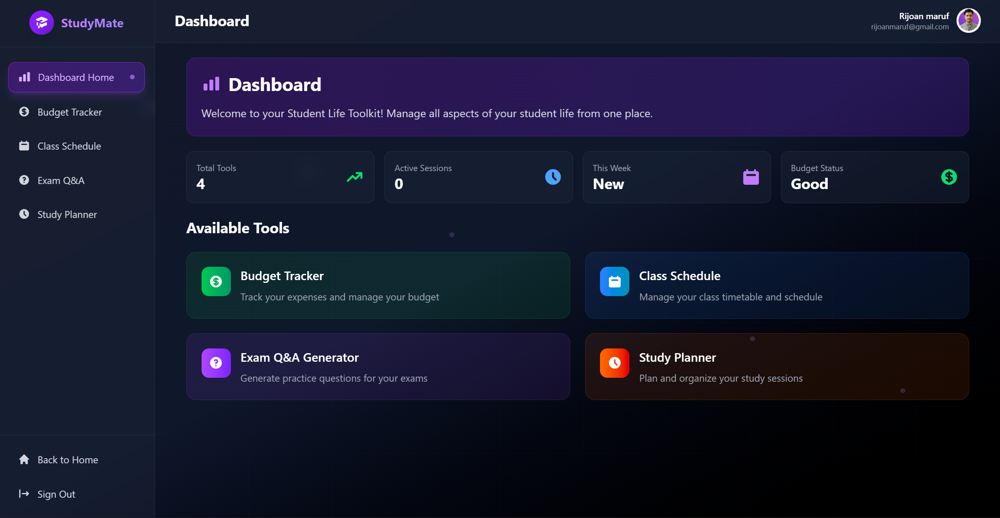

# 🎓 Student Life Toolkit



## 🌟 Overview

Student Life Toolkit is a comprehensive web application that helps students manage every aspect of their academic life. From budget tracking to class scheduling, exam preparation to study planning - everything you need is in one beautiful, intuitive platform.

### ✨ Live Demo
🔗 **[Visit StudyMate Live](https://studymate.rijoan.com/)**

## 🚀 Key Features

### 💰 **Budget Tracker**
- Track income and expenses
- Set spending limits and categories
- Visual spending analytics
- Monthly/weekly budget reports
- Smart financial insights

### 📅 **Class Schedule Manager**
- Create and manage class timetables
- Never miss a class with smart reminders
- Calendar integration support
- Conflict detection for overlapping schedules
- Export to external calendar apps

### 🤖 **AI-Powered Q&A Generator**
- Generate practice questions from study materials
- Smart exam preparation assistance
- Subject-specific question generation
- Difficulty level customization
- Performance tracking and insights

### 📚 **Study Planner**
- Organize study sessions effectively
- Set academic goals and track progress
- Task prioritization and deadlines
- Study time analytics
- Productivity insights and recommendations

## 🛠️ Tech Stack

- **Frontend**: React 18.x
- **Build Tool**: Vite
- **Styling**: Tailwind CSS
- **Icons**: Heroicons, React Icons
- **Routing**: React Router DOM
- **Authentication**: Firebase Auth
- **Database**: Firebase Firestore
- **Deployment**: Firebase Hosting
- **State Management**: React Context API

## 📦 Installation & Setup

### Prerequisites
- Node.js (v18 or higher)
- npm or yarn package manager
- Git

### Clone the Repository
```bash
git clone https://github.com/mdrijoanmaruf/Student_Toolkit_Client.git
cd Student_Toolkit_Client
```

### Install Dependencies
```bash
npm install
# or
yarn install
```

### Environment Setup
Create a `.env.local` file in the root directory and add your Firebase configuration:
```env
VITE_FIREBASE_API_KEY=your_api_key
VITE_FIREBASE_AUTH_DOMAIN=your_auth_domain
VITE_FIREBASE_PROJECT_ID=your_project_id
VITE_FIREBASE_STORAGE_BUCKET=your_storage_bucket
VITE_FIREBASE_MESSAGING_SENDER_ID=your_sender_id
VITE_FIREBASE_APP_ID=your_app_id
```

### Run Development Server
```bash
npm run dev
# or
yarn dev
```

The application will be available at `http://localhost:5173`

### Build for Production
```bash
npm run build
# or
yarn build
```

## 🎨 Design & UI

- **Modern Glass-morphism Design** with backdrop blur effects
- **Responsive Layout** - Works seamlessly on desktop, tablet, and mobile
- **Purple/Violet Theme** with gradient accents
- **Smooth Animations** and hover effects
- **Dark Theme** optimized for extended study sessions
- **Intuitive Navigation** with clear visual hierarchy

## 📱 Responsive Design

- **Desktop**: Full-featured dashboard with multi-column layouts
- **Tablet**: Optimized 2-column layouts with touch-friendly interactions
- **Mobile**: Single-column responsive design with collapsible navigation

## 🔐 Security Features

- **Firebase Authentication** for secure user management
- **Data Encryption** for sensitive financial information
- **Privacy-First Approach** - Your data stays secure
- **Account Deletion** - Full control over your data

## 🌐 Browser Support

- Chrome (recommended)
- Firefox
- Safari
- Edge
- All modern browsers with ES6+ support

## 📊 Project Structure

```
src/
├── Components/          # Reusable UI components
├── Contexts/           # React Context providers
├── Dashboard/          # Dashboard feature modules
│   ├── BudgetTracker/
│   ├── ClassSchedule/
│   ├── ExamQnA/
│   └── StudyPlanner/
├── Firebase/           # Firebase configuration
├── Hook/              # Custom React hooks
├── Layouts/           # Layout components
├── Loading/           # Loading components
├── Pages/             # Page components
│   ├── Home/
│   ├── About/
│   ├── Contact/
│   └── Login/
├── Route/             # Routing configuration
└── Shared/            # Shared components (Navbar, Footer)
```

## 🤝 Contributing

We welcome contributions! Please feel free to submit a Pull Request. For major changes, please open an issue first to discuss what you would like to change.

### Development Guidelines
1. Fork the repository
2. Create a feature branch (`git checkout -b feature/AmazingFeature`)
3. Commit your changes (`git commit -m 'Add some AmazingFeature'`)
4. Push to the branch (`git push origin feature/AmazingFeature`)
5. Open a Pull Request

## 📄 License

This project is licensed under the MIT License - see the [LICENSE](LICENSE) file for details.

## 👨‍💻 Developer

**Md Rijoan Maruf**
- Portfolio: [portfolio.rijoan.com](https://portfolio.rijoan.com)
- GitHub: [@mdrijoanmaruf](https://github.com/mdrijoanmaruf)
- LinkedIn: [mdrijoanmaruf](https://www.linkedin.com/in/mdrijoanmaruf/)
- Email: rijoanmaruf@gmail.com

## 🙏 Acknowledgments

- Built with ❤️ for students, by a student
- Special thanks to the React and Vite communities
- Icons by Heroicons and React Icons
- UI inspiration from modern design systems

## 📞 Support

If you have any questions or need help:
- 📧 Email: rijoanmaruf@gmail.com
- 📱 Phone: +8801813606468
- 🐛 Issues: [GitHub Issues](https://github.com/mdrijoanmaruf/Student_Toolkit_Client/issues)

---

<p align="center">
  <strong>⭐ If you find this project helpful, please give it a star! ⭐</strong>
</p>

<p align="center">
  Made with 💜 by <a href="https://portfolio.rijoan.com">Md Rijoan Maruf</a>
</p>
